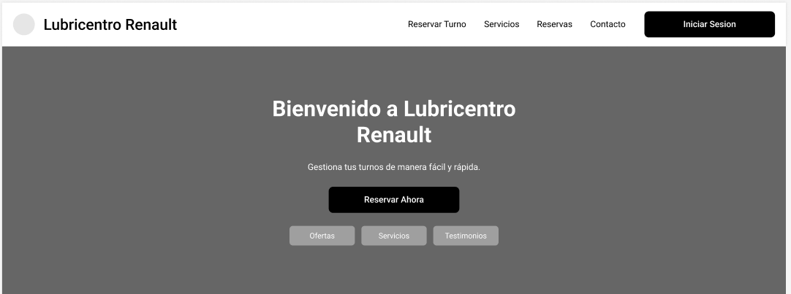
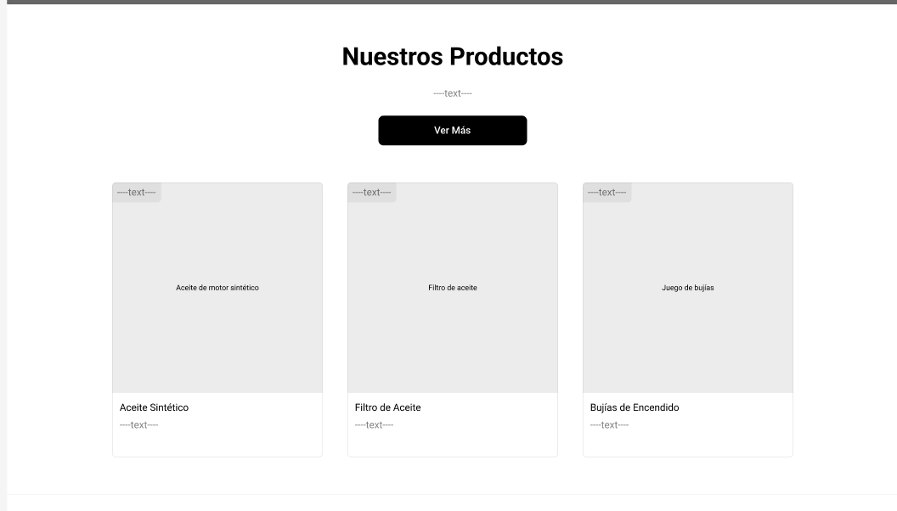
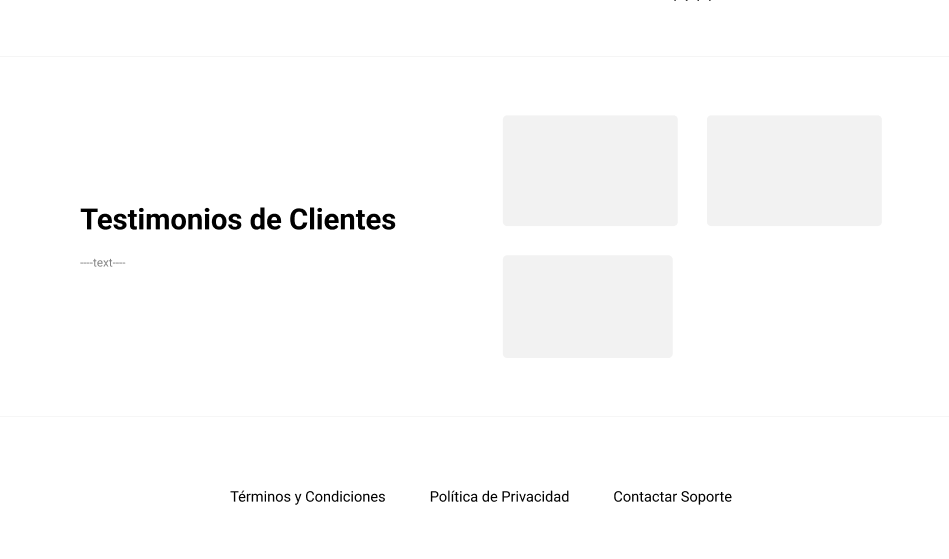
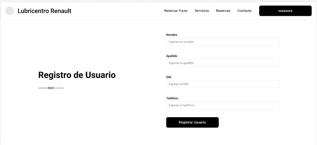
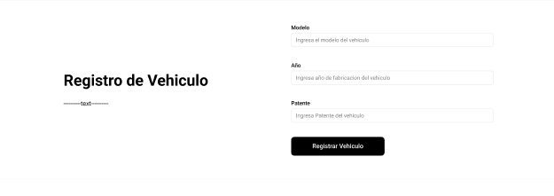
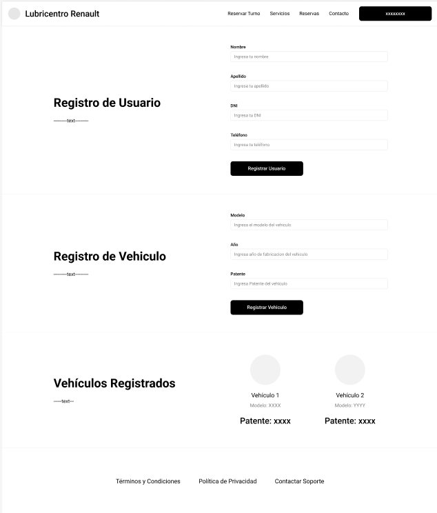
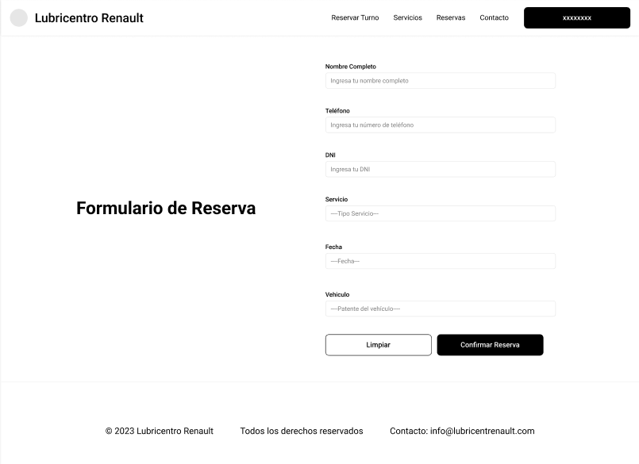
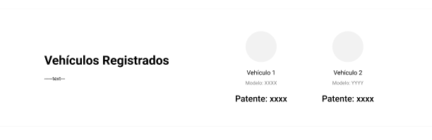

# 📐 Wireframes - Sistema de Gestión de Turnos

Esta sección muestra los wireframes diseñados para el sistema de gestión de turnos de vehículos. Cada pantalla refleja una parte clave del flujo de interacción del usuario con el sistema.

---

## 🏠 Pantalla Principal (Home)

Vista general y secciones internas de la pantalla inicial.

- **Home completo**  
  

- **Secciones de Home**
   
  
  
  
  

---

## 👤 Registro de Usuario

Formulario para registrar un nuevo usuario en el sistema.

---

## 🚗 Registro de Vehículo

Pantalla para cargar información de un vehículo asociado al usuario.

---

## 📋 Registros Completos

Vista para consultar y gestionar los registros de usuarios y vehículos.

---

## 📅 Reserva de Turno

Formulario para agendar un turno para service o mantenimiento.

---

## 🔍 Visualización de Vehículos

Pantalla para consultar y modificar vehículos registrados.

---

> 🗂️ Todas las imágenes están en la carpeta `./Wireframe/`
